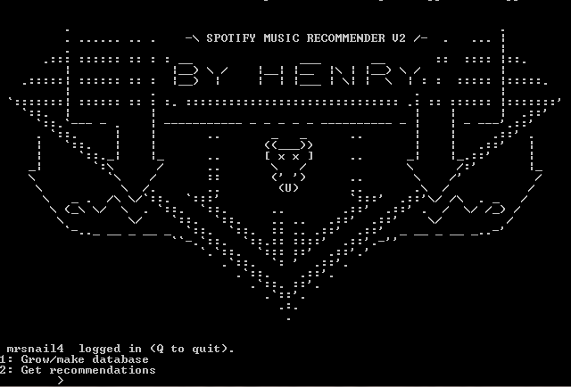
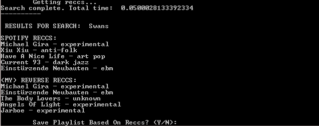
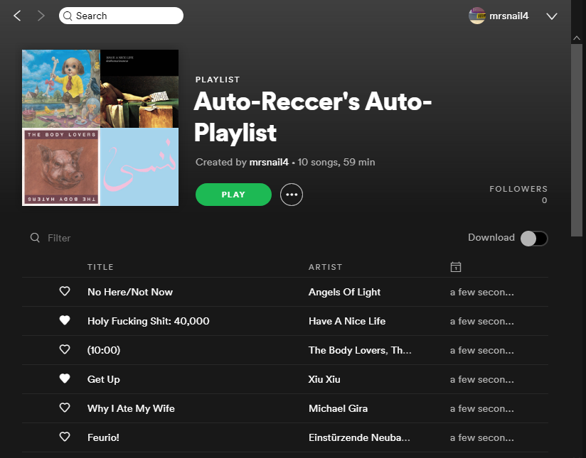

# better-recommendations
My concept for an improved Spotify recommendation system, using a connected graph of 1.2 million Spotify artists stored in an SQL database. You can search for an artist, and it will give you some other artists you might like, with an option to automatically create a playlist as well.

To run this, you need to firstly fill out the config file provided, and also create an empty folder named "data" in the directory (this is where the database file will go).

Eventually this is going to go on a web app, once I figure out how the heck Flask works, but in the meantime you can play with it using CLI.py, which provides a crude command-line interface.

HOW IT WORKS:
------------
Everyone knows that the spotify recommendation system is underwhelming. The two key problems I identified with it were:
  - It looks at your play history, and so only recommends music that is basically the same as what you already listen to
  - It mostly recommends mainstream, popular bands you have probably already heard of

I wanted to make an algorithm to recommend new music to me that would pull me outside of a comfort zone a little, and provide more interesting reccs, using only the Spotify API. The first issue is easily solved by deliberately using a "dumb" algorithm that knows nothing about the user, to avoid inadvertently pigeonholing them and introduce more variety.

The second issue I actually solved by turning it against itself, using the way Spotify recommendations work.
Generally speaking, recommendations flow uphill, which is to say that less mainstream artists point to more mainstream artists. What I needed to do was effectively "reverse" the default spotify recommendation system, by taking the target artist and getting a list of other artists that "point" to the target in their own respective recommendations.

The issue is that there is no way to do this in the native API, so I made some functions to create and then fill out an SQL database of every artist on spotify and the first 10 default Spotify recommmended artists they point to.

This database will have a total size of 320MB when filled out with all 1.2 million artists, which seems perfectly acceptable. Currently I only bothered to run it for the first 500,000 artists, just to make sure it was all working fine.

SAMPLE IMAGES:
---------

|  | 
| *Splash Screen* |
|:--:| 
||
| *Example results for the noise-rock band "Swans"*|
|:--:| 
||
| *Example resulting playlist for Swans* |

NOTES:
------
Filling the database takes a while (5 days), mostly limited by Spotify's in-house API rate limiting which is unavoidable. Currently, to scrape all 1.2 million artists should take approximately 5 days of constant runtime. However, the database "grows" somewhat naturally around a starting kernel, so the database should be perfectly usable for the vast majority of users even with only ~10% of the complete dataset. Use the "Deep Dive" method included in the GUI if you want to grow the database around a specific niche or microgenre.

Artists who are so obscure that the spotify recommendation system doesnt work for them are ignored (in my experience generally those with less than 1000 total streams)

I have some ideas for other recommendation algorithms I am still working on, as well as the possibility of creating similar databases with rateyourmusic.com to catalogue artist popularity/ratings, etc etc.
